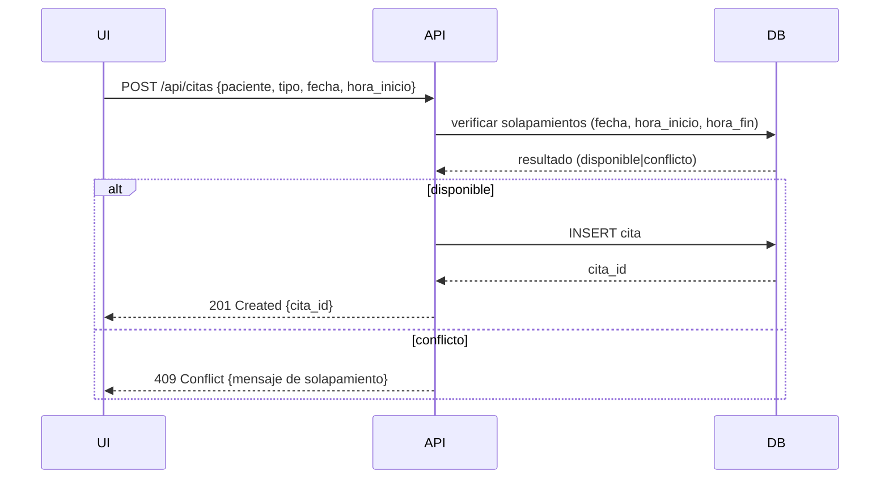
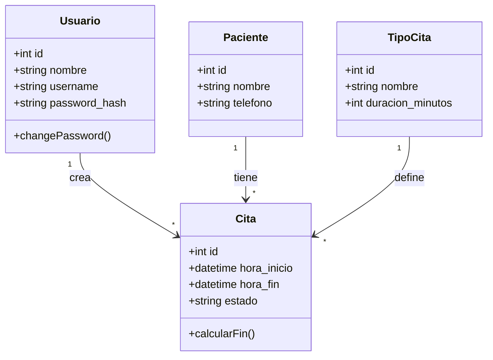

# Diagramas Arquitectónicos — Consultorio Dental Castillo
(Archivo estructurado para copiar y pegar directamente en GeraSoft)

---

## 1. Diagrama de Casos de Uso
Crea este registro en la sección **Diagramas (Casos de Uso)**. Copia el siguiente código y pégalo en el editor Mermaid:

```mermaid
%%{init: {"theme":"base"}}%%
usecaseDiagram
  actor Dentista
  actor Recepcionista
  Dentista --> (Iniciar sesión)
  Dentista --> (Ver calendario)
  Dentista --> (Crear cita)
  Dentista --> (Editar cita)
  Dentista --> (Reagendar cita)
  Dentista --> (Generar enlace WhatsApp)
  Recepcionista --> (Crear cita)
  Recepcionista --> (Listado de citas)
```

---

## 2. Diagrama de Secuencia
Crea este registro en la sección **Diagramas (Secuencia)**. Copia el siguiente código y pégalo en el editor Mermaid:



---

## 3. Diagrama de Clases
Crea este registro en la sección **Diagramas (Clases)**. Copia el siguiente código y pégalo en el editor Mermaid:



---

## 4. Diagrama de Paquetes
Crea este registro en la sección **Diagramas (Paquetes)**. Copia el siguiente código y pégalo en el editor Mermaid:

```mermaid
package "Frontend (React)" {
  component Calendar
  component ModalCita
  component ListaCitas
}
package "Backend (Express)" {
  component Auth
  component API_Citas
  component API_Config
  component DB_Access
}
package "Base de Datos" {
  component SQLite
}

Frontend (React) --> Backend (Express)
Backend (Express) --> SQLite
```
